 
# Inducción Innovacción Virtual

## Objetivos 🥅

Al finalizar este modules deberas de tener: 
- Una cuenta de GitHub.
- Acceso al GitHub Teacher Toolbox.
- Acceso a la organización.

## GitHub Teacher Toolbox

    

Formar a la próxima generación de desarrolladores de software, es un gran trabajo.  
Enseñe a sus alumnos con las herramientas estándar de la industria, para que puedan brillar en los equipos técnicos.

Prepare a sus alumnos con herramientas del mundo real. Creamos GitHub Teacher Toolbox para brindarles a los educadores acceso gratuito a las mejores herramientas de desarrollo en un solo lugar. Utilice herramientas líderes en la industria en su salón de clases, sin costo alguno. Automatice, supervise y mejore su flujo de trabajo utilizando los recursos proporcionados por algunos de nuestros socios y amigos.

Como tus Sherpas Digitales, tenemos para ti una mochila virtual con todos los elementos necesarios para que puedas afrontar tus retos, terminar el programa y seguir en constante desarrollo. Incluso, cuando el ciclo haya finalizado.

### ¿Cómo Funciona?

Para poder acceder a los beneficios del GitHub Teacher Toolbox, es necesario contar con una cuenta de correo institucional de **Innovacción Virtual**, así cómo un documento que acredite tu status activo. **No te preocupes, nosotros te proveemos de una.** 

En este repositorio encontrarás las instrucciones para poder activar tu GitHub Teacher Toolbox, haciendo uso de tu cuenta de Innovacción Virtual.

### ¿Qué necesito?

Para poder acceder a los beneficios que otorga el GitHub Teacher Toolbox es necesario:

* Contar con una cuenta de **Innovacción Virtual**.
* Tener mínimo 13 años de edad.
* Contar con una cuenta de **GitHub (Si no tienes, te enseñamos a hacer una)**.
* Constancia de status de **Innovacción Virtual  [Aquí la puedes descargar](https://innovaccion-my.sharepoint.com/:f:/g/personal/fochoa_innovaccion_mx/EoOMsxwAubNDuMQBC0-kdtMBEsj2svS6erjsPD5DNx4frg?e=TjrjLv)** sólo selecciona tu eje y busca tu nombre.

## Instrucciones

* [ ] [Crear una cuenta de GitHub](#creando-una-cuenta-de-github)
* [ ] [Verificar la cuenta de GitHub](#verificar-la-cuenta-de-correo-en-github)
* [ ] [Activar el GitHub Teacher Toolbox](#activando-el-teacher-toolbox)
* [ ] [Ingresar a la Organización](#ingresar-a-la-organizacion)

## Creando una cuenta de GitHub

Ingresa a la página de [GitHub](https://github.com/) y rellena los campos que a continuación te solicitan con la siguiente información:


**Username:** Un nombre de Usuario con el que serás identificado, te recomendamos escoger un nombre corto, puede ser algo como ```NombreApellido```. Si no está disponible puedes agregar, la letra de tu segundo apellido, un numero o algún distintivo.
Ejemplo: 
* ```RodolfoFerro``` 
* ```FernandaOchoa```

**Correo:** **Tu correo de Innovacción Virtual, termina con @innovaccion.mx**  
**Contraseña:** Asegúrate de guardar en un lugar seguro tu contraseña, ya que la necesitarás en varias ocasiones al usar GitHub.

Una vez terminado el proceso deberás tener algo como lo que se muestra a continuación.

  

Ahora procedemos a dar clic en **Sign up for GitHub** 

Nos pedirá verificar que no somos un robot el que está intentando acceder, tendremos una pantalla similar. Basta con dar clic en Verificar, nos pedirá hacer Identificar un elemento en una imagen, etc.  

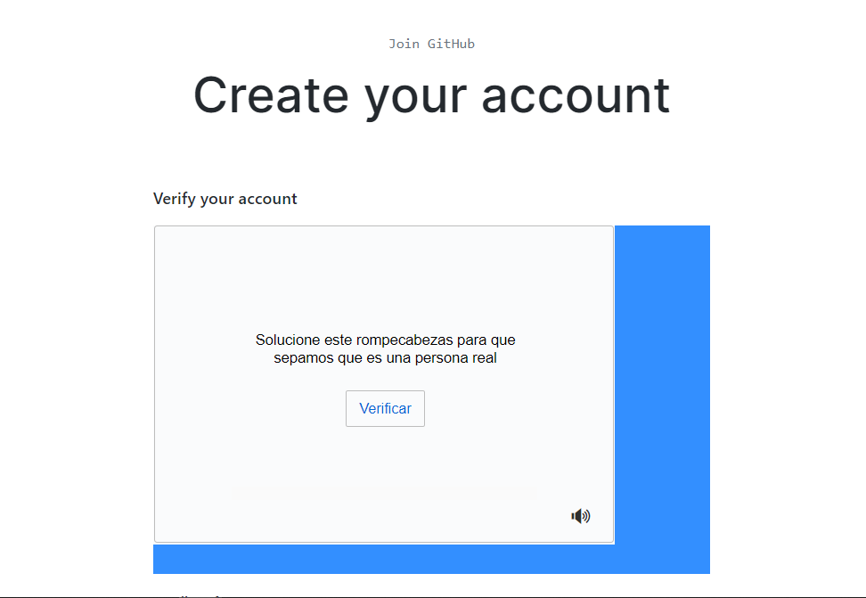  

Al terminar la verificación damos se mostrará una palomita verde y damos clic en **Join a Free Plan**  

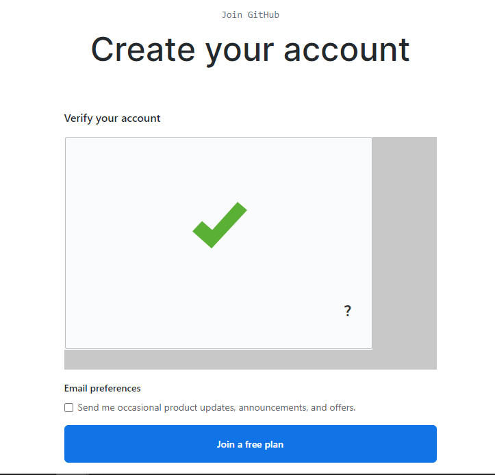  

A continuación tendremos que seleccionar de una serie de opciones, aquellas con las que nos identifiquemos. Por ejemplo, Maestro (Teacher).  

  

También podremos seleccionar el nivel de experiencia que tenemos en programación de software. 
* **None**: Nunca he programado nada
* **A little**: Voy iniciando en la programación
* **A moderater amount**: Tengo un poco de experiencia previa.
* **A lot**: Tengo mucha experiencia previa.

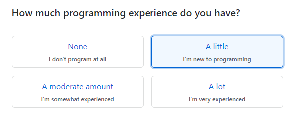   

Posteriormente, nos pregunta ¿Para qué queremos utilizar GitHub?, Podemos seleccionar hasta 3 opciones.
Entre las opciones se encuentran:

* Aprender a Programar
* Aprender Git y GitHub
* Crear un repositorio (Almacenar un projecto)

* Crear una página web con GitHub WebPages
* Para colaborar entre equipos
* Encontrar o contribuir a un proyecto open source

* Para trabajar en proyectos escolares
* Consumir el API de GitHub
* Otro

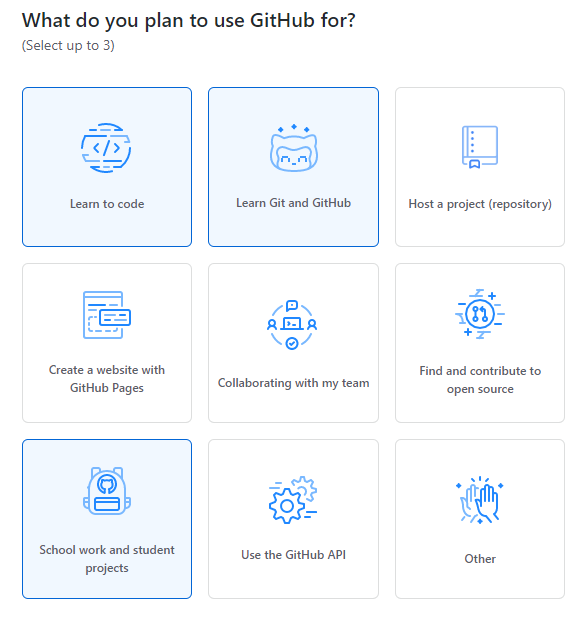  

Finalmente nos pregunta acerca de nuestros intereses, igualmente podemos escribir algunos. 
Por ejemplo: Lenguajes de programación, algún Framework o Industria.   

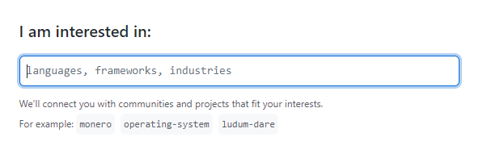  

Al dar enter nos mostrará la siguiente pantalla, informando que debemos verificar nuestra cuenta de correo.  

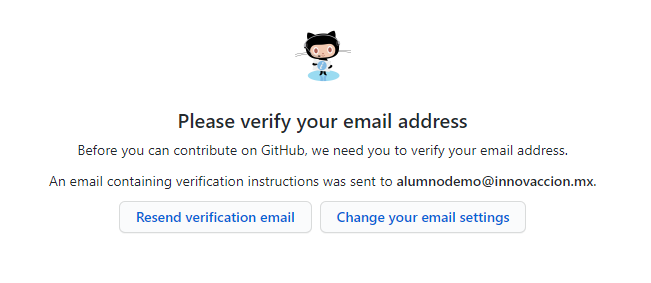  

## Verificar la Cuenta de Correo en GitHub

Para verificar nuestra cuenta de correo, debemos seguir estos pasos:

* Ingresar a la siguiente dirección ```https://outlook.office365.com/``` o dar [clic aquí](https://outlook.office365.com/) 

* Nos pedirá nuestra cuenta de correo, por lo que escribimos nuestra cuenta de **Innovacción Virtual **
        @innovaccion.mx  
    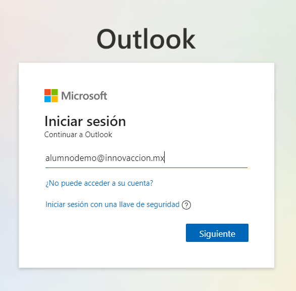    

* Al dar clic en siguiente nos pedirá nuestra contraseña de la cuenta de correo.  
    *     

* Tendremos en nuestra bandeja de entrada un nuevo correo electrónico de GitHub le damos clic para abrirlo.    
    * 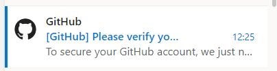  

* El correo es el siguiente, damos clic en **Mostrar contenido bloqueado**  
    * 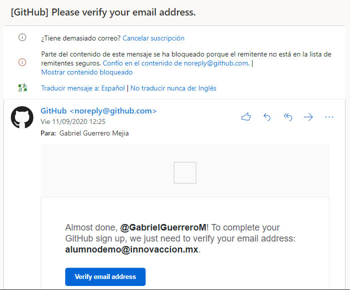  

* Clic en **Verify email address**  
    * 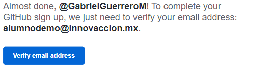  

* Automáticamente nos abrirá una nueva ventana con el mensaje de que ha sido verificada nuestra cuenta.  
    * 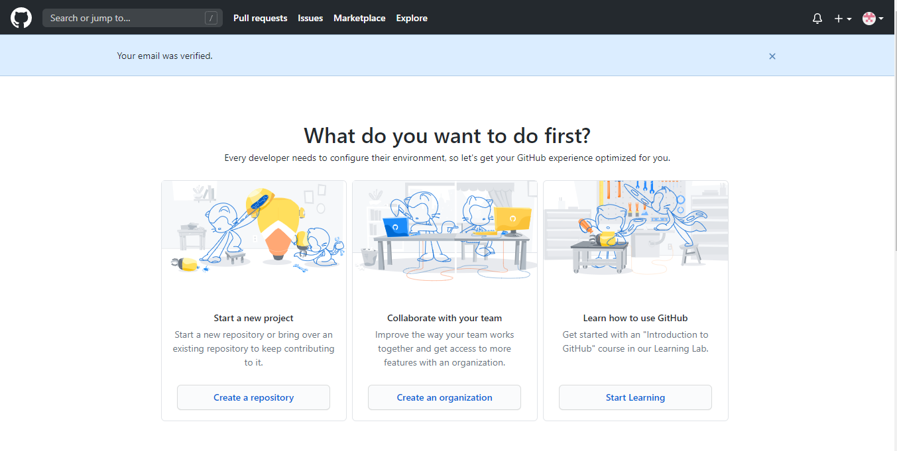  
    
* En nuestra bandeja de entrada tendremos un correo con la verificación exitosa.
    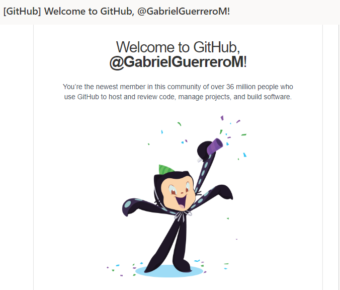  


## Activando el GitHub Teacher Toolbox

Ahora que ya tenemos un correo y la cuenta de GitHub podemos aplicar para el GitHub Teacher Toolbox.

* Ingresamos al siguiente link: [Aquí](https://education.github.com/discount_requests/teacher_application?utm_source=2020-09-13-Innovaccion)  

* Nos mandará a nuestro formulario de aplicación al GitHub Teacher Toolbox
    * 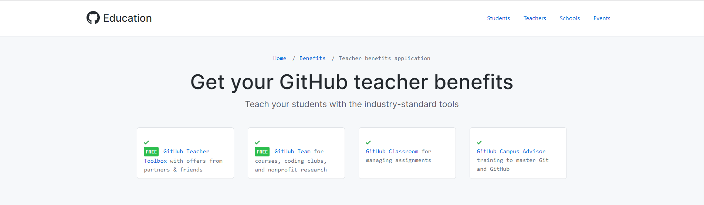  

* Como podemos observar el link que te proporcionamos aquí esta pre-aprobado directamente.
    * 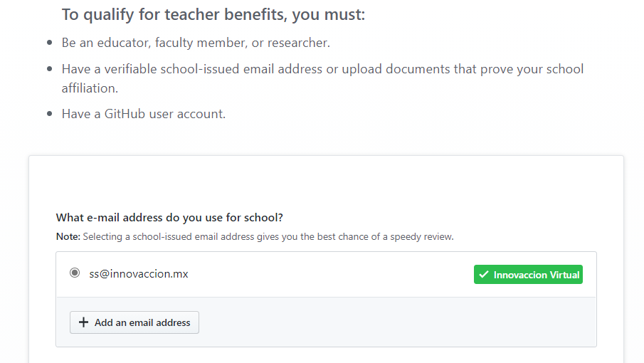  

* Más abajo ya se encuentra por defecto **Innovacción Virtual** como el nombre de nuestra escuela.  
    * 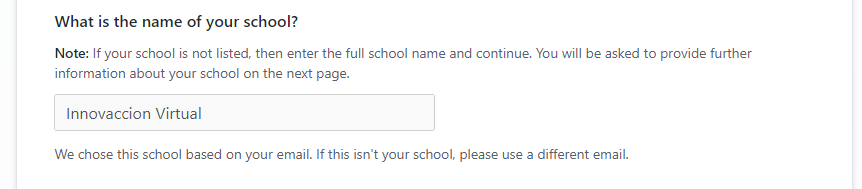  
    
* Sólo debemos escribir **En Inglés**, Cómo planeamos utilizar nuestro GitHub Teacher Toolbox. 
    * Podemos mencionar cosas como: Aprender a desarrollar nuevos proyectos, almacenar los proyectos que desarrollas, etc.   

    * 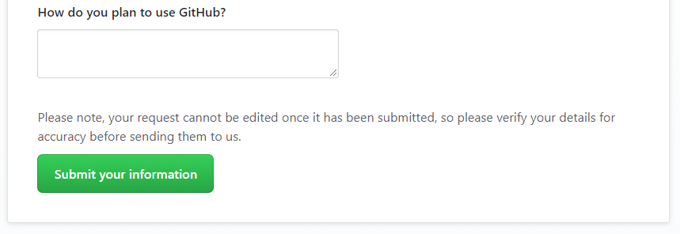   
    
* Damos clic en Submit your information, para enviar nuestra información y nos pedirá una constancia que acredite nuestro estatus en el programa.   

    * 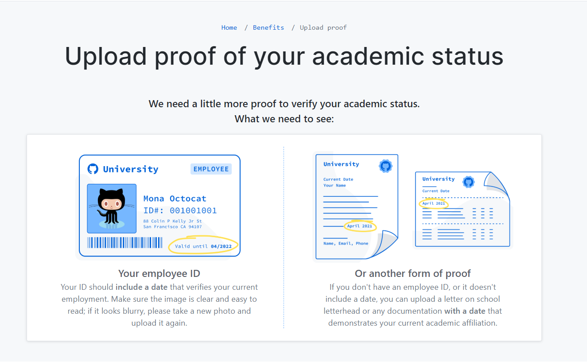   
    
* Seleccionamos la opción **Upload Image** y subimos nuestra constancia.
    * 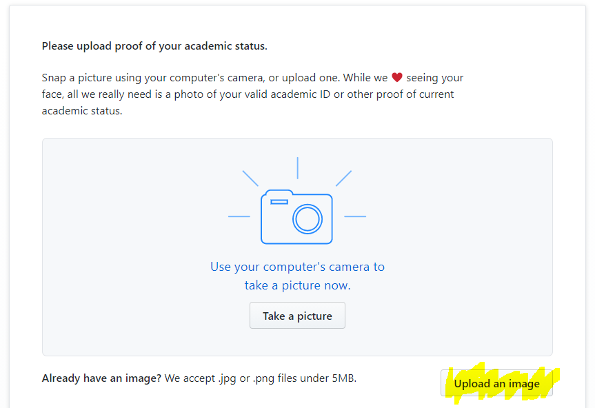
    
* Tendremos la siguiente pantalla, por lo que seleccionamos Submit your information.
    *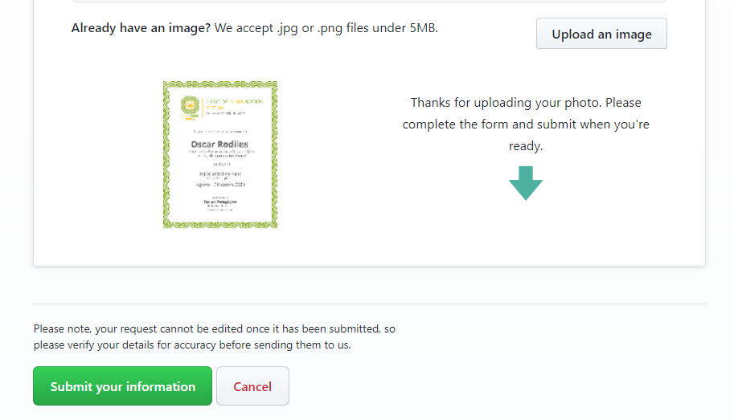

* Nuestra información ha sido enviada a GitHub Education  
    * 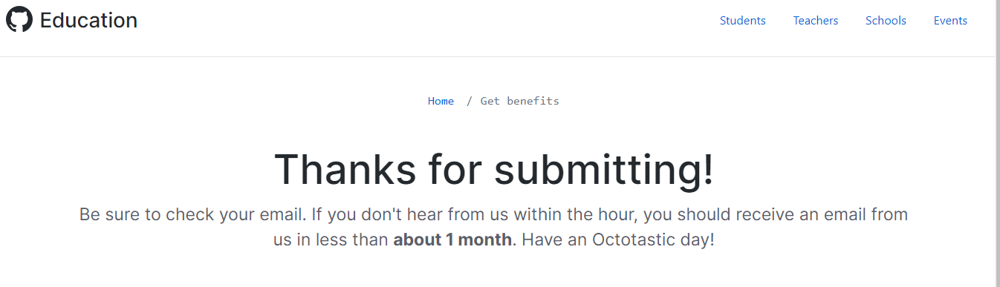
    
* Una vez enviado, recibiremos un correo de confirmación y revisaran nuestra solicitud.  
    * 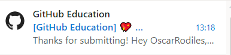   
    
    * 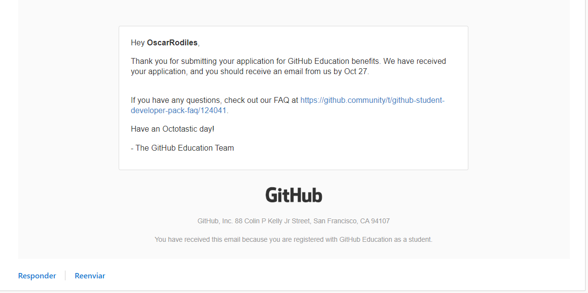

* Recibiremos un email en un lapso de 1 hora a 3 dias hábiles. En este caso, llego en 5 min al apartado de otros. Le doy clic a **Otros: nuevas conversaciones**

    * 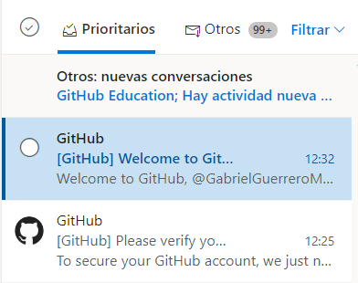  
    

## Ingresar a la organizacion

Para ser parte de la organización en GitHub, debemos hacer lo siguiente:

* Dar [Clic aquí](https://innovaccion-teacher.herokuapp.com/) para tener la siguiente pantalla  
    * 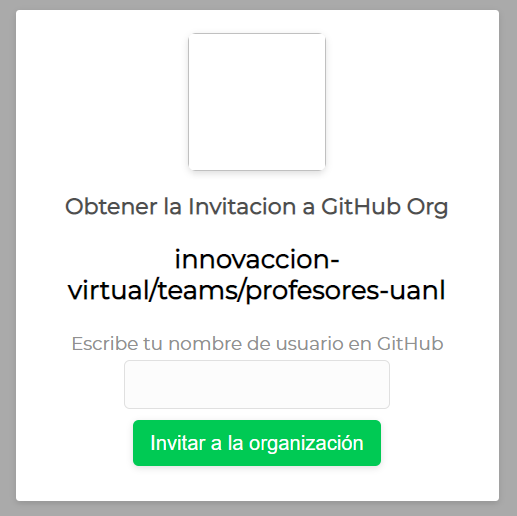  

* Escribimos nuestro **Nombre de Usuario en GitHub** 
    * Si no sabes cuál es, [entra aquí](https://github.com) y aquí podrás encontrar el nombre de usuario que escogiste.
        *     
    Ese es el nombre de usuario con el que vas a solicitar tu invitación a la organización.  
    * 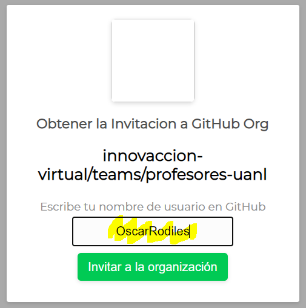  
* Seleccionamos **Invitar a la organización**  

* Revisamos nuestro correo, ya que la invitación está en nuestra cuenta de correo de **Innovacción Virtual**
    *   
* El correo es como se muestra a continuación y damos clic en el link de la organización (Señalado con amarillo)  
    *   
* Ahora estaremos en la página de GitHub con la siguiente notificación, damos clic en **View Invitation**
    * 
* Tenemos nuestra invitación a la organización en GitHub y sólo debemos dar clic en **Join innovaccion-virtual**
    * 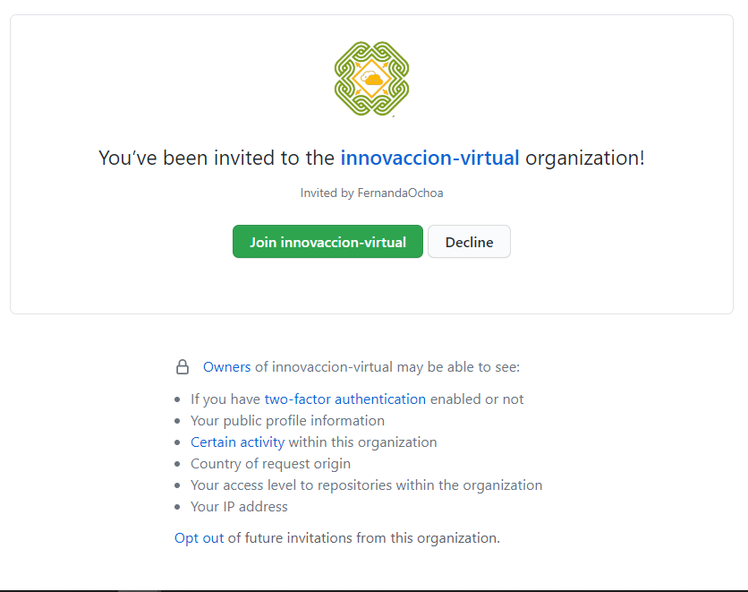
* Ahora eres miembro de la organización en GitHub
    * 

## Conclusión del Modulo ✅

Habrás completado el modulo cuando:

- Tengas una cuenta de GitHub.
- Tengas acceso al GitHub Student Developer Pack.
- Seas parte de la organización del programa.